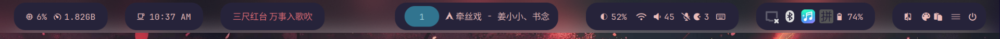

# MoeKoe Music — Waybar 歌词插件

实时将 MoeKoe Music 当前播放的歌词行显示在 Waybar 状态栏中。
*ai生成的脚本2333*

---
## 效果展示



---

## 工作原理

MoeKoe Music 内置了一个 WebSocket 服务器（`ws://127.0.0.1:6520`）。  
开启 **API 模式** 后，播放器每 ~200ms 向所有已连接客户端推送：

| 消息类型 | 内容 |
|---|---|
| `lyrics` | 完整 KRC 歌词文本 + 当前播放时间（秒）+ 歌曲信息 |
| `playerState` | 是否正在播放 + 当前播放时间 |

脚本（Python / Bash）接收这些消息，解析 KRC 格式定位当前歌词行，然后输出 Waybar 所需的 JSON。

---

## 安装步骤

### 1. 在 MoeKoe Music 中开启 API 模式

打开 MoeKoe Music → 设置 → 找到「**API 模式**」→ 切换为**开启**。

> 开启后，WebSocket 服务器会在应用启动时自动监听 `127.0.0.1:6520`。


---

### 2. 安装依赖（按你选择的脚本）

#### 方案 A：Python 脚本（`moekoe-lyrics.py`）

```bash
pip install websocket-client
# 或使用系统包管理器（Arch）：
# sudo pacman -S python-websocket-client
```

#### 方案 B：Bash 脚本（`moekoe-lyrics.sh`）

需要以下依赖：

- `websocat`
- `jq`
- `awk`（系统通常已自带）

可先检查是否已安装：

```bash
command -v websocat jq awk
```

若缺少（Arch 示例）：

```bash
sudo pacman -S websocat jq gawk
```

---

### 3. 安装脚本

将脚本复制到 Waybar 脚本目录并赋予执行权限：

```bash
mkdir -p ~/.config/waybar/scripts
```
```bash
# Python 方案
cp plugins/waybar/moekoe-lyrics.py ~/.config/waybar/scripts/moekoe-lyrics.py
chmod +x ~/.config/waybar/scripts/moekoe-lyrics.py
```

# Bash 方案
cp plugins/waybar/moekoe-lyrics.sh ~/.config/waybar/scripts/moekoe-lyrics.sh
chmod +x ~/.config/waybar/scripts/moekoe-lyrics.sh
```

使用前建议检查可执行权限是否生效：

```bash
ls -l ~/.config/waybar/scripts/moekoe-lyrics.py ~/.config/waybar/scripts/moekoe-lyrics.sh
```

如需快速在终端测试脚本是否能输出 Waybar JSON（先确保 MoeKoe Music 已开启 API 模式）：

```bash
# 测试 Python 脚本（输出 1 行后退出）
~/.config/waybar/scripts/moekoe-lyrics.py | head -n 1

# 测试 Bash 脚本（输出 1 行后退出）
~/.config/waybar/scripts/moekoe-lyrics.sh | head -n 1
```

---

### 4. 配置 Waybar

编辑 `~/.config/waybar/config`（或 `config.jsonc`），参考 `waybar-config-snippet.jsonc` 中的内容：

**① 在模块列表中加入模块名：**
```json
"modules-center": ["custom/moekoe-lyrics"]
```

**② 在配置文件中添加模块定义（任选一种）：**

Python 方案：
```json
"custom/moekoe-lyrics": {
    "exec": "$HOME/.config/waybar/scripts/moekoe-lyrics.py",
    "return-type": "json",
    "interval": "once",
    "tooltip": true,
    "max-length": 40,
    "on-click": "python3 -c \"import websocket,json; ws=websocket.create_connection('ws://127.0.0.1:6520'); ws.send(json.dumps({'type':'control','data':{'command':'toggle'}})); ws.close()\""
}
```

Bash 方案：

```json
"custom/moekoe-lyrics": {
    "exec": "$HOME/.config/waybar/scripts/moekoe-lyrics.sh",
    "return-type": "json",
    "interval": "once",
    "tooltip": true,
    "max-length": 40,
    "on-click": "printf '%s\n' '{\"type\":\"control\",\"data\":{\"command\":\"toggle\"}}' | websocat -t ws://127.0.0.1:6520 >/dev/null 2>&1",
    "on-click-right": "printf '%s\n' '{\"type\":\"control\",\"data\":{\"command\":\"next\"}}' | websocat -t ws://127.0.0.1:6520 >/dev/null 2>&1",
    "on-click-middle": "printf '%s\n' '{\"type\":\"control\",\"data\":{\"command\":\"prev\"}}' | websocat -t ws://127.0.0.1:6520 >/dev/null 2>&1"
}
```

---

### 5. 配置样式（可选）

将 `waybar-style-snippet.css` 中的内容追加到 `~/.config/waybar/style.css`：

```bash
cat plugins/waybar/waybar-style-snippet.css >> ~/.config/waybar/style.css
```

---

### 6. 重载 Waybar

```bash
killall waybar && waybar &
# 或者（如果使用 systemd）：
# systemctl --user restart waybar
```

---

## 文件说明

| 文件 | 用途 |
|---|---|
| `moekoe-lyrics.py` | 与 WebSocket 保持长连接、解析歌词、持续输出 Waybar JSON |
| `moekoe-lyrics.sh` | Bash 版本：功能与 Python 版本一致，依赖 `websocat + jq + awk` |
| `waybar-config-snippet.jsonc` | Waybar 模块配置示例（含鼠标点击控制） |
| `waybar-style-snippet.css` | 可选的 CSS 样式片段 |

---

## 可用 CSS 类

脚本输出时会给每条 JSON 附带一个 `class` 字段，可在 CSS 中用 `#custom-moekoe-lyrics.<class>` 分别定制：

| 类名 | 触发条件 |
|---|---|
| `playing` | 正在播放 |
| `paused` | 已暂停 |
| `disconnected` | 与 WebSocket 断开连接 |
| `connecting` | 启动/正在连接 |
| `error` | 缺少依赖等错误 |

---

## 鼠标操作

因为懒还没测试应该是能用

---

## 自定义脚本参数

打开 `moekoe-lyrics.py`，顶部有几个可调参数：

```python
WS_URL          = "ws://127.0.0.1:6520"  # WebSocket 地址（勿改）
RECONNECT_DELAY = 3    # 断线后重连等待秒数
OUTPUT_INTERVAL = 1.0  # 向 Waybar 输出 JSON 的刷新间隔（秒）
POLL_INTERVAL   = 0.2  # WebSocket 读取超时（秒）
IDLE_TEXT       = "MoeKoe"
CONNECTING_TEXT = "MoeKoe"
DISCONNECTED_TEXT = "MoeKoe"
```

---

## 常见问题

**模块一直显示「未连接」**  
→ 确认 MoeKoe Music 正在运行，且设置中 API 模式已开启。

**看不到歌词，只显示 ⏸ 或空白**  
→ 确认该歌曲有歌词（在应用内打开歌词面板验证），某些纯音乐无歌词属正常。

**`⚠ 缺少依赖` 报错**  
→ 运行 `pip install websocket-client` 后重启 Waybar。
